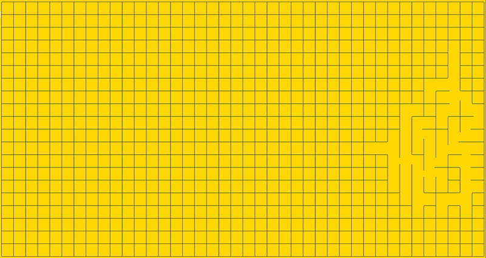

# Description

## What is a labyrinth ?

**“A labyrinth is not a place to be lost, but a path to be found.”**


A labyrinth, or maze, is a winding path, which may or may not feature junctions, dead ends and false leads, designed to mislead or slow down anyone attempting to navigate it. This motif, which first appeared in prehistoric times, can be found in many civilisations in various forms. In Greek mythology, the labyrinth is a series of passages built by the architect Daedalus to imprison the Minotaur.

In a figurative sense, a labyrinth refers to a complex, winding system that can be concrete (architecture, urban planning, gardens, etc.) or abstract (structures, ways of thinking, etc.), and in which it is common to lose one’s way because one fails to grasp the overall path.

Labyrinths can be divided into two categories:
- **Perfect** labyrinths, in which each cell is connected to all the others in a unique way.
- **Imperfect** labyrinths, which are all labyrinths that are not perfect (they may therefore contain loops, islands or inaccessible cells).

## Project description

The aim of this project is to create a programme capable of generating a maze and then solving it by identifying the shortest path between the entrance and the exit. Before embarking on this project, we looked into the practical applications of maze generation and solving in computer science: this can prove extremely useful in many fields, including video games, robotics, geolocation, transport and art. Mastering the skills developed in this project will therefore be very useful for the rest of our educational and professional careers.

**Functionalities**:
- Configuration file parsing
- Maze displaying with applicable themes while its generation and solving
- Menues displaying and navigation with WASD and arrow keys
- Theme selection, maze and configuration saving, found path hiding
- New maze generation with the following variables:
	- Height / Width
	- Entry / Exit coordinates
	- Perfect or not
	- Pattern (drawing, icon) that will be implemented at the center of the maze
	- Generation / Solving algorithms
	- Seed (randomizable)
	- Output file for maze
	- Generation speed

**Demonstration video of a maze generating using our program:**



**This project allowed us to greatly improve the following skills:**

- Component conception
- Graph generation
- Package management
- Recursion
- 2D rendering
- Object-Oriented programming
- Data Serialization
- Configuration Management
- Packaging & Distribution
- Graph traversal
- Simple pathfinding
- Functional Documentation

# Instructions

To use this project, you can download its zip file from github, or by running this command in a terminal located in the chosen destination:

```bash
git clone https://github.com/Belladone-Bzz/A_maze_ing
```

And to run it, ensure python is installed on your computer or virtual environment, and run the following commands:

```bash
pip install -r requirements.txt
python a_maze_ing.py config.txt
```

If you're unsure of these commands' action or want to run the program in a virtual environment without typing every command, see the instruction for the Makefile just below.

## Makefile

This project contains a Makefile, a file that is used to pre-enter commands to run to perform different tasks like installation, running and cleaning. The following rules are integrated here:

| Rules | Action |
|---|---|
| install | create a virtual environment and install dependencies |
| build | create a package file containing everything in the maze_gen folder |
| run | run the a_maze_ing file with arguments, ensuring everything is installed |
| debug | run the a_maze_ing file with arguments through pdb |
| clean | remove mypy cache, python cache, build files and output_file |
| fclean | run clean and remove the virtual environment |
| lint | run flake8 and mypy with flexible rules |
| lint-strict | run flake8 and mypy with strict rules |

To run any, enter 'make' followed by the selected rule in a terminal located at the project's root folder, like so:

```bash
make install
```

Executing `make` alone is an equivalent to `make run`.

## Configuration file

To run this project, it's necessary for it to contain a file named 'config.txt' at its root. One is provided with comments to explain each value, and it can be updated with a text editor or through the program itself. Here are the variables it contains:

| Mandatory values | Format | Effect |
|---|---|---|
| WIDTH / HEIGHT | Positive integer above 3 | Change the maze's dimensions |
| ENTRY / EXIT | Positive integers forming coordinates like 0,0 | Place the entry and exit points in the maze (must be within dimensions and outside of pattern) |
| PERFECT | Either True or False | Toggle the perfect attribute of the maze (False if the maze can contain loops and multiple paths) |
| GEN_ALGORITHM | Name of the selected algorithm | Available: Backtracking, Prim, Hunt_and_kill
| SOL_ALGORITHM | Name of the selected algorithm | Available: Breadth_search, Dead_end_filler, Dijkstra, A_star
| OUTPUT_FILE | Name of the file in which the maze will be saved | The output format is explained below in the output section |

| Optional values | Format | Effect |
|---|---|---|
| SEED | Positive integer | Change the seed of all randomization during the maze's generation |
| THEME | Name of the selected theme | Assign a theme to the generation and display of the first maze |
| PATTERN | Name of the selected pattern | Assign a pattern to the first generated maze |
| GEN_SPEED | Integer between 0 and 10 | Adapt the number of cells either accessed during generation or visited during solving between each display |

For more details on what each value does and the list of available algorithms, themes and patterns, see the integrated 'config.txt' file.

## Integrated Maze package

As stated below in the [flexibility of our code](#Flexibility-of-our-code) section, this project contains a buildable package to ensure an easy reusability of the Maze class, containing all generation related methods, as well as the configuration checking.

To create it, install this project or clone it using `git clone` and open a terminal in its root folder (where Makefile is located). Run `make build`, and a folder named 'dist' should be created at 'a_maze_ing_project/maze_gen/dist'.

It contains both `*.tar.gz` and `*.whl` files, both usable by pip to install the whole maze_gen folder in your python distribution or virtual environment. This will enable you to include our Maze class using `from mazegenerator import Maze`, as well as its related Enums and custom types.

To instantiate this class, you must construct it with all expected config variables, which you can see an example of in the code at the bottom of the maze.py file. And for more details on how the class comes together with its attributes and methods, see the implemented readme file.

# Functionalities explained

## Generation algorithms

**A much more detailed description of these algorithms can be found in the [README.md file of the relevant module](a_maze_ing_project/maze_gen/README.md).**

During our research, we found that there are many algorithms capable of generating mazes, each with their own advantages and disadvantages. We decided to develop several generation algorithms that operate in very different ways. As we opted for a dynamic display of the maze generation process, these differences are clearly visible. Beyond the aesthetic and playful appeal, we felt it was important to highlight the diversity of these algorithms.

All the algorithms implemented begin with the following steps:

- Start with a grid full of walls.
- Choose a random cell as the starting point and mark it as part of the maze.

### Backtracking algoritm

This algorithm is based on a depth-first search (DFS) with backtracking when a dead end is encountered. The advantage of the backtracking algorithm is that it generates **complex** and **perfect** mazes with numerous twists and turns. The depth-first nature of this algorithm is why this happens. It explores each path deeply before backtracking, leading to long, winding corridors that twist and turn as they reach dead-ends and backtrack.

Visually, this algorithm will generate an initial winding path. As soon as it reaches a dead end, it will turn back and continue on its way, until the entire grid has been processed and incorporated into the maze.

**Simplified method:**

- A random available cell adjacent to the starting cell is chosen and added to the maze and becomes the new starting cell. We use a list to keep track of the path.
- This step is repeated until a dead end is reached (the starting cell has no more adjacent cells available).
- If a dead end is reached, backtracking mode is activated to go back and find another available neighbouring cell.
- These steps are repeated until the very first starting cell is reached again.

### Prim algorithm
Rather than working edgewise across the entire graph, Prim algorithm starts at one point, and grows outward from that point. Mazes generated by Prim’s algorithm share many of the characteristics of those created via Kruskal’s algorithm, such as having an abundance of very short dead-ends, giving the maze a kind of "spiky" look. 

Visually, mazes generated by a Prim algorithm will give the impression of sprouting like the roots of a tree or a coral.

**Simplified method:**
- We look at all the available cells adjacent to the starting cell and add them to a set called ‘frontiers’.
- One of these is chosen at random and becomes the new starting cell. Its neighbouring cells are also added to the ‘frontiers’ set.
- These steps are repeated until the ‘frontiers’ set is empty.

### Hunt and kill algorithm

The hunt-and-kill algorithm is somewhat similar to backtracking. The difference lies in what happens when it encounters a dead end: instead of backtracking, it scans the grid from top to bottom and continue from the first cell found that has a neighbour belonging to the maze. On small mazes, the backtracking and hunt-and-kill algorithms are similar; the difference becomes apparent on large mazes.

Visually, the generation looks like a well-organised backtracking process.

**Simplified method:**
- A random available cell adjacent to the starting cell is chosen and added to the maze and becomes the new starting cell.
- This step is repeated until a dead end is reached (the starting cell has no more adjacent cells available).
- If a dead end is reached, Hunt mode is activated to check the grid from top to bottom and find the first cell who has a neighbor in the incoming maze. The program stop when the check comes to the last cell of the grid.

### Imperfect maze generation

We gave a great deal of thought to the generation of imperfect mazes. We could have simply broken down walls at random in our imperfect mazes to create loops. However, to make the imperfect mazes more aesthetically pleasing and avoid the creation of rooms, we employed several methods.

- Firstly, we used a method that only breaks walls when there are at least three consecutive horizontal or vertical walls in a row; by breaking the one in the middle (with an 80% probability), this prevents the creation of rooms. In the case of small mazes, this method was not always feasible.
- In such cases, all the dead ends in the maze were analysed. The priority was to break down the wall opposite the entrance to the dead end whenever possible. If this was not possible, we looked for a dead-end with two consecutive walls on at least one of its sides in order to break through a wall.
- If this was still not feasible, only then would we randomly break through a side wall of a dead-end. This method has enabled us to minimise the generation of chambers, which only occur in rare cases in 3x3 mazes.

## Solving algorithms

As for generation algorithm, we wanted to explore multiple existing methods of solving a maze. We chose the ones that seemed to align most with our way of thinking, and 2 weighted graph algorithms to also learn graph generation and solving. Here are summarized descriptions of each:

### Breadth First Search

Find the path from the entrance to the exit in a perfect or imperfect maze. The breadth first algorithm explore all unvisited cells in the maze from the entry and stop as soon as it find the exit cell. Each visited cell is marked as such along with its closest cell from the entrance (the one we come from), and the final found path (mathematically the shortest) is recovered from exit back to the entrance.

### Dead End Filler

Find the path from the entrance to the exit in a perfect maze only. This dead-end detection algorithm identifies all the dead ends in the maze (excluding the entrance and exit if they are part of them). These cells are marked as visited. The dead ends are then updated in a loop until the only cells remaining with `is_visited = False` are the path from the entrance to the exit. The algorithm then create a list of the cells that form the entrance-to-exit path.

### Dijkstra's Algorithm

Finds the shortest path in a perfect or imperfect maze. Sets a list of intersection_cells made of every cell with less than 1 wall and calculate the distance between each to generate a weighted graph, including the entry and exit. Checks then each of their distance out from the start, priorizing lighter distances, until all paths are counted.

Goes back from the exit, adding to the shortest_path each path to take to go back an intersection that's the closest from the entry.

### A* Star

Uses the same methods as Dijkstra's algorithm, except for the order of accessing new cells when calculating the distances from the entry (as this part is the longest in time). It always accesses the cell considered to be the closest from the exit, in our method using the Manhattan distance, so it doesn't stray in every dead-end. See resources for more details on what all these notions mean.

## Display

The display felt for us to be an essential part for this project, equally to the generating and solving of the mazes. It's an occasion to show, organize and give the user control over the features we implemented. This is why the terminal interface of this project is divided between the maze displaying and the menues navigation.

To go beyond displaying the maze once it's generated, we had to adapt both our Maze and MazeSolver classes. This is why you will find all maze generation and solving related methods actually return a `Generator`, used as a way to pause the running process and print an updated version of the maze, looking something like this: `for _ in maze.algorithm(): print(maze)`.

### Maze display

There are many simplified or over the top ways to print boxes in a terminal, and for this project, we chose not to give ourselves any limitation.

Displaying the maze takes a list of special characters to print walls and cells content (if they are visited and such) line by line, and for each intersection, recovers a set of 4 boolean bits from the presence or absence of walls and converts it into an index to print the right character.

This function is the one called during the maze's generation and solving, but it is complemented with the displaying of the central pattern (works the same but with different characters) once the maze is complete.

### Themes

To polish off the display, we integrated a theme-applying feature to control colors, characters and styling used in the maze and menues display. These variables are preset but can be easily customized by adding new Theme object to a dictionary.

These themes pull their values from enumerations of special characters but also color and style codes used to create ASCII escape sequences (see resources for info). They take the form of subclasses passed to display functions for them to retrieve the right values to print.

### Menues

Menues could be considered their own module as they implement their own display, navigation and can perform numerous operations. All the functions related to this are nested together to keep access to few variables such as the configuration dictionary, the current menu and its currently selected options and a potential error message.

Each menu is first implemented as a dictionary containing its options, their type, their associated configuration entry and a function to execute when applicable. To navigate them, the a_maze_ing program calls the navigation function with the user's input, and it is then parsed into multiple actions: confirm, back and directional arrows, to update itself or the maze's configuration.

## Output

When saving the maze to a file, it is first converted into text in a specific format.

First, each cell is represented as an hexadecimal value (0 to F, 0 to 15) specifying which of its walls are open or closed, calculated from the 4-bits booleans of each direction (0 is open, 1 is walled), in this order:

| 3 | 2 | 1 | 0 (LSB) |
|---|---|---|---|
| West | South | East | North |

So for example, a cell with the East and North sides walled (┐) is (0011) in binary, converted to 3.

When every cell has been converted, the entry and exit coordinates are written down in (x,y) format, each on a line.

Finally, the path found by the solving algorithm is written with each direction to take one after the other (NESW).

# Flexibility of our code

To ensure a good development during the project's creation, as well as possible improvements and overall readability, we found it crucial to divide the code into modules that are as independant to each other as possible. Of course, there are limitations, as the displaying and solving of the maze necessitates one that respects the same structure as the one in the maze_gen module, but it still helped us a lot not to step on each-other's work, refactor it more easily and document it more clearly.

As documentation is key to make a project easier to go back to and improve, we included multiple readme files for modules that could use the explanations, or could be usable on other projects. This is why, for our maze generating module, we included everything needed to create a package file that can be opened with pip.

# Resources

## Generation algorithms:

https://codebox.net/pages/maze-generator/online

https://medium.com/@batu.senturk/maze-generation-showdown-kruskals-vs-wilsons-vs-iterative-backtracking-45b3127863ef

https://weblog.jamisbuck.org/2011/2/7/maze-generation-algorithm-recap

https://professor-l.github.io/mazes/

https://www.cs.cmu.edu/~112-n22/notes/student-tp-guides/Mazes.pdf


- Backtracking algorithm:

  https://aryanab.medium.com/maze-generation-recursive-backtracking-5981bc5cc766

  https://weblog.jamisbuck.org/2010/12/27/maze-generation-recursive-backtracking

- Hunt and kill algorithm:

  https://weblog.jamisbuck.org/2011/1/24/maze-generation-hunt-and-kill-algorithm

- Prim algorithm:

  https://weblog.jamisbuck.org/2011/1/10/maze-generation-prim-s-algorithm

## Solving algorithms:

https://medium.com/@batu.senturk/foundational-algorithms-in-computer-science-dfs-vs-bfs-d723458eda44

https://medium.com/@batu.senturk/maze-wars-which-is-the-best-maze-solving-algorithm-4102d3115191

- Breadth first search algorithm:

  https://medium.com/@prajun_t/breadth-first-search-bfs-db7ffb384da7

  https://www.geeksforgeeks.org/dsa/breadth-first-search-or-bfs-for-a-graph/

- Dead-end filling algortihm:

  https://medium.com/@batu.senturk/dead-end-filling-a-unique-approach-to-maze-solving-e79c8005e276

- Dijkstra algorithm:

  https://www.maths-cours.fr/methode/algorithme-de-dijkstra-etape-par-etape

  https://medium.com/@batu.senturk/the-smartest-graph-traversals-a-and-dijkstras-algorithm-41dbbd5421b5

- A star algorithm:

  https://www.redblobgames.com/pathfinding/a-star/introduction.html

  https://levelup.gitconnected.com/a-star-a-search-for-solving-a-maze-using-python-with-visualization-b0cae1c3ba92

## Display:

- Special characters:

  https://gist.github.com/fnky/458719343aabd01cfb17a3a4f7296797

  https://en.wikipedia.org/wiki/List_of_Unicode_characters#Box_Drawing

- Menues navigation:

  https://www.tutorialspoint.com/article/posix-style-tty-control-using-python

  https://code.activestate.com/recipes/572182-how-to-implement-kbhit-on-linux/

# Team and project management

> [!NOTE]
> No AI was used in the making of this project.

#### [Jolyne](https://github.com/jolyne-mangeot) :

- Configuration file reading and parsing with BaseModel class
- Maze and errors displaying, menues navigating and themes applying (maze_display module)
- Graph generating and solving research (Dijkstra, A-star)
- Maze output with found path in external file

#### [Belladone-Bzz](https://github.com/Belladone-Bzz) :

- Ressource research (generation algorithms, solving algortihms).
- Generation Algorithms (Backtraking, Prim, Hunt and kill).
- Imperfect maze functions and overall testing (maze_gen module)
- Solving algorithms (Breadth first search, Dead-end filling).

For each our work, we tested and documented it with either or both dedicated readme's and docstrings.

If we sometimes peer-coded some parts of each module, it was pretty clear from the start which module interested us the most to conceptualize and code. We both used the conception branch with Obsidian to take our own notes and write down references, though the project went along its way mostly without issues. We chose to stay longer rather than cutting corners so most of the project is optimized and readable, but if changes could have been made from the start, we would probably have used the curses module for the display and navigation, as coding everything from scratch sometimes made convoluted code. To expand on the project, infinitely more algorithms could be added to our Maze and MazeSolving classes. We also thought of making themes customizable from the program, making every special character, colors and styling available to the user directly, but it would have taken too much time and organization for little result.
